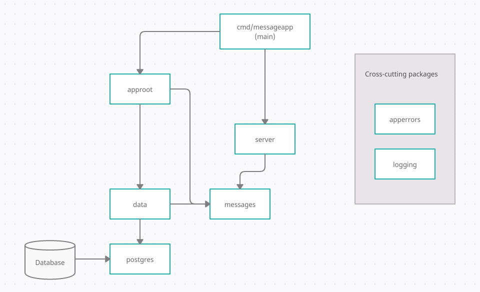

# Application Architecture

The application is architected as follows.

| Package | Description |
| ------- | ----------- |
| cmd  | Contains application binaries. |
| approot | Acts as the connector between the data and domain layer. |
| message | Contains the business logic for Messages and is currently the primary domain package. |
| data | Contains the database logic for the application adhering to the Repository specifications in the domain (in this case just messages). |
| server | Contains the server logic and handler implementation for the REST API. |
| apperrors | Contains core application error handling logic. |
| logging | Contains core application logging logic. |
| postres | Contains postgres connection helpers. |

## Test packages

| Package | Description |
| ------- | ----------- |
| testing | Contains integration level tests. |
| testutil | Contains utility packages for testing. |
